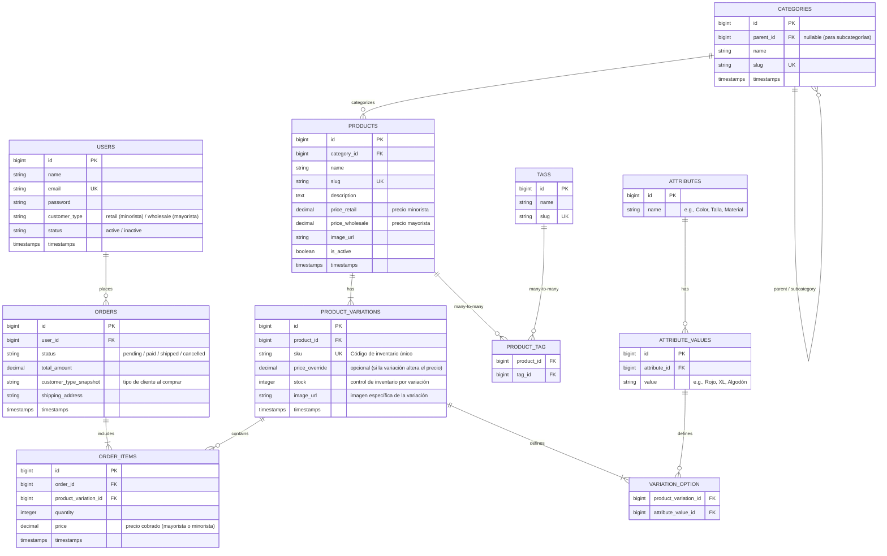

# Planeamiento del Sistema de Comercio Electrónico (E-Commerce) - Laravel 13 + Livewire 4 + MySQL

Este documento detalla la planificación general, arquitectura, modelo de datos adaptado y flujos de usuario para la plataforma de comercio electrónico utilizando el stack de **Laravel 13**, **Livewire 4** y **MySQL**, optimizado para velocidad de desarrollo, reactividad moderna y compatibilidad con hosting compartido.

---

## 1. Arquitectura del Sistema

*   **Backend & Frontend (Monolito Híbrido):** **Laravel 13** (requiere PHP 8.3+) junto con **Livewire 4**. Todo el código se gestiona en un solo repositorio. Livewire 4 permite estructurar el desarrollo mediante componentes auto-contenidos, reduciendo la complejidad y eliminando la redundancia de código JavaScript.
*   **Interactividad ligera:** **Alpine.js** (integrado nativamente en Livewire 4) para micro-interacciones rápidas en el cliente.
*   **Estilos:** **Tailwind CSS** para una interfaz responsiva y premium adaptada a dispositivos móviles.
*   **Base de Datos:** **MySQL 8.0 / MariaDB** (soporte estándar en cPanel/Laragon).

---

## 2. Modelo de Base de Datos (Relacional)

Para cumplir con los requerimientos específicos del cliente (categorías jerárquicas, variaciones de producto, etiquetas y precios diferenciados por tipo de cliente), la estructura de datos es la siguiente:

### Explicación del modelo de datos:
1.  **Categorías y Subcategorías:** Se manejan en la misma tabla `categories` usando una relación reflexiva (`parent_id` apunta a la categoría padre). Si `parent_id` es `null`, es una categoría principal; de lo contrario, es una subcategoría.
2.  **Variaciones de Productos:** 
    *   Un producto padre (`products`) tiene el nombre y la descripción general.
    *   Las variaciones físicas específicas (`product_variations`) tienen su propio SKU, stock y precio opcional (por ejemplo, si la talla XXL cuesta más).
    *   La tabla pivote `variation_option` conecta cada variación con sus atributos específicos (e.g., conecta una variación de SKU `CAM-ROJ-XL` con el valor de atributo "Rojo" y con "XL").
3.  **Precios y Clientes:**
    *   La tabla `users` tiene un campo `customer_type` (`retail` para minoristas, `wholesale` para mayoristas).
    *   La tabla `products` almacena ambos precios base (`price_retail` y `price_wholesale`).
    *   Cuando un usuario inicia sesión, Livewire consulta el `customer_type` y renderiza dinámicamente el precio que le corresponde en todo el catálogo y carrito.

## 3. Funcionamiento de Livewire 4 (Reactividad y Estructura en el E-commerce)

Livewire 4 se encargará de hacer que la tienda se sienta como una aplicación reactiva moderna sin recargar la página, utilizando componentes de un solo archivo (Single-File Components) con extensión `.wire.php` para simplificar la organización del código:

*   **Estructura SFC (`.wire.php`):** La lógica PHP del backend y la vista Blade se unifican en un único archivo por componente (e.g., `cart-button.wire.php`), haciendo que el desarrollo sea extremadamente rápido y limpio.
*   **Transiciones Fluidas (`wire:transition`):** Implementamos animaciones nativas del navegador al agregar productos o abrir elementos del carrito sin necesidad de librerías CSS pesadas.
*   **Componente `ProductCatalog`:** 
    *   Permite filtrar por categorías, subcategorías y etiquetas de manera asíncrona.
    *   Detecta automáticamente el tipo de cliente logueado para mostrar el precio correcto (al por mayor o al por menor).
*   **Componente `ProductDetails` (Selector de Variaciones):**
    *   Al hacer clic en un color o medida (atributos), actualiza dinámicamente el stock disponible, la imagen del producto y el precio en pantalla.
*   **Componente `Cart` (Carrito de Compras):**
    *   Suma, resta y elimina productos de forma instantánea.
    *   Actualiza el total recalculando con base en las reglas de cliente mayorista/minorista en tiempo real utilizando la arquitectura de islas para aislar la actualización del componente.
*   **Componente `Checkout`:**
    *   Valida los datos de envío paso a paso (`wire:model`) y genera la orden de compra en estado pendiente.
